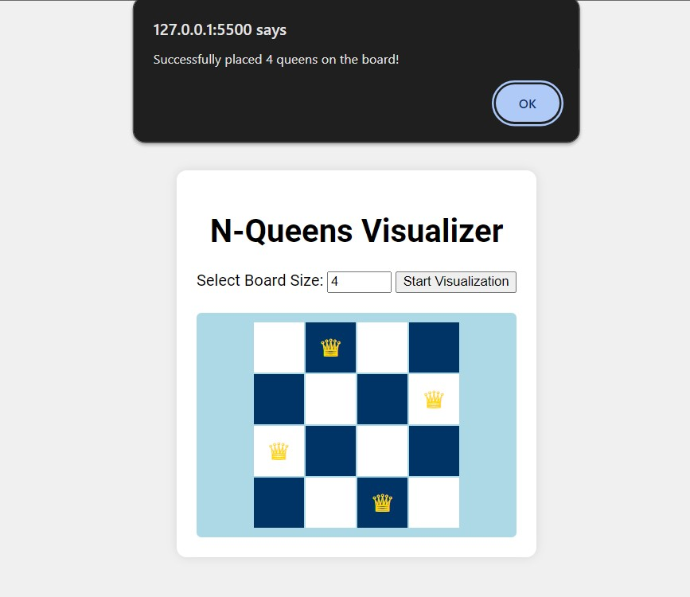

# N-Queens Visualizer


This project is a visualizer for the N-Queens problem, demonstrating the process of solving the problem using backtracking. It allows users to select the size of the chessboard and visualizes the placement and removal of queens step-by-step.

## Project Live Link
[Live Demo](https://n-queens-seven.vercel.app/)

## Table of Contents

- [Introduction](#introduction)
- [Features](#features)
- [Technologies Used](#technologies-used)
- [Getting Started](#getting-started)
  - [Prerequisites](#prerequisites)
  - [Running the Visualizer](#running-the-visualizer)
- [Usage](#usage)
- [Contributing](#contributing)
- [License](#license)
- [Acknowledgements](#acknowledgements)

## Introduction

The N-Queens problem is a classic computer science problem where the goal is to place N queens on an N×N chessboard such that no two queens threaten each other. This project visualizes the backtracking process used to solve the N-Queens problem, showing each step of placing and removing queens on the board.

## Features

- Select the size of the chessboard (between 4 and 20).
- Visualize the backtracking process of solving the N-Queens problem.
- Highlight the positions of the queens on the board.
- Display alerts when no solution is found for the selected board size.
- Alert on successful placement of N queens.

## Technologies Used

- HTML
- CSS
- JavaScript

## Getting Started

### Prerequisites

To run this project locally, you need a web browser that supports HTML5, CSS3, and JavaScript.

### Running the Visualizer

1. Clone the repository:
   ```sh
   git clone https://github.com/hkalra0001/N-Queens.git
2. Navigate to the project directory:
   ```sh
   cd N-Queens
3. Open the 'index.html' file in your preferred web browser.  

## Usage
1. Open the index.html file in a web browser.
2. Select the size of the chessboard using the input field.
3. Click the "Start Visualization" button to begin the visualization.
4. Watch as the algorithm places and removes queens, showing the backtracking process.
5. An alert will notify you when N queens are successfully placed or if no solution is found.

## Contributing
Contributions are welcome! If you have any ideas, suggestions, or improvements, please feel free to submit a pull request or open an issue.

1. Fork the repository.
2. Create your feature branch (git checkout -b feature/YourFeature).
3. Commit your changes (git commit -m 'Add some feature').
4. Push to the branch (git push origin feature/YourFeature).
5. Open a pull request.
## License
This project is licensed under the MIT License - see the LICENSE file for details.

## Acknowledgements
- This project was inspired by the classic N-Queens problem and aims to provide an educational tool for visualizing backtracking algorithms.
- Thanks to the contributors and the open-source community for their valuable inputs and contributions.
